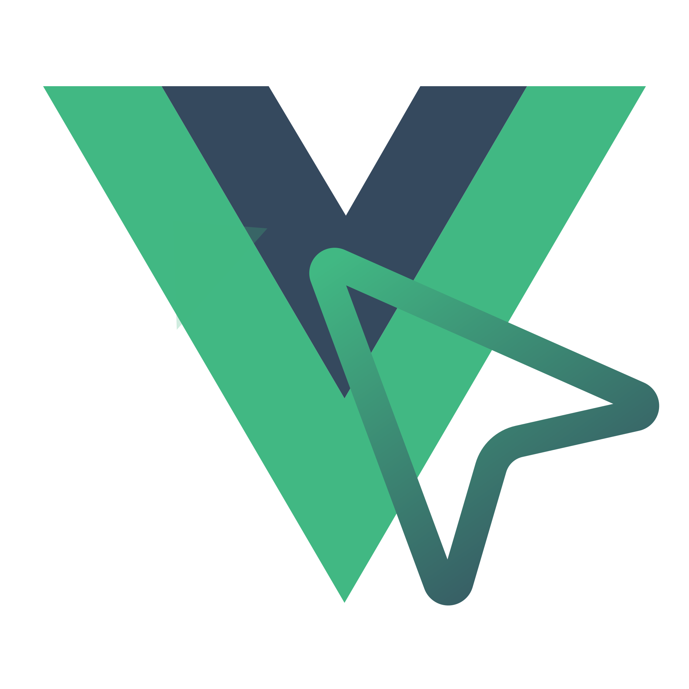

#  Vue Grab

[](https://bundlephobia.com/package/vue-grab)
[](https://npmjs.com/package/vue-grab)
[](https://npmjs.com/package/vue-grab)

> A Vue port of [React Grab](https://github.com/aidenybai/react-grab) by Aiden Bai

Grab any element in your Vue app and give it to Cursor, Claude Code, etc. to change.

By default coding agents cannot access elements on your page. Vue Grab fixes this - just point and click to provide context!

- Hold <kbd>⌘C</kbd> and click on any element on your page
- Works with Cursor, Claude Code, OpenCode
- Just a single script tag (it's just JavaScript!)
- Shows Vue component hierarchy and file paths

### [Try out a demo! →](https://vue-grab.mohil.dev)

## Install

Get started in 1 minute by adding this script tag to your app:

```html
<script
  src="//unpkg.com/vue-grab/dist/index.global.js"
  crossorigin="anonymous"
  data-enabled="true"
></script>
```

If you're using a Vue framework or build tool, view instructions below:

### Vite

1. Run `npm i vue-grab@latest`
2. Add this to your `vite.config.ts`:

```ts
import { defineConfig } from "vite";
import vue from "@vitejs/plugin-vue";
import { vueGrab } from "vue-grab/plugins/vite";

export default defineConfig({
  plugins: [vue(), vueGrab()],
});
```

### Nuxt

Add this inside of your `app.vue` or layout file:

```vue
<template>
  <div>
    <Head>
      <Script
        v-if="isDev"
        src="//unpkg.com/vue-grab/dist/index.global.js"
        crossorigin="anonymous"
        data-enabled="true"
      />
    </Head>
    <NuxtPage />
  </div>
</template>

<script setup>
const isDev = process.env.NODE_ENV === "development";
</script>
```

## How it Works

Vue Grab works by:

1. Listening for a keyboard shortcut (default: Cmd+C held for 500ms)
2. Showing an overlay on elements you hover over
3. When you click, it grabs the element's HTML structure and Vue component information
4. Copies it to your clipboard in a format optimized for AI coding assistants
5. Optionally opens Cursor or other tools with the context

## Configuration

You can configure Vue Grab with data attributes:

```html
<script
  src="//unpkg.com/vue-grab/dist/index.global.js"
  crossorigin="anonymous"
  data-enabled="true"
  data-adapter="cursor"
  data-hotkey="Meta,G"
  data-key-hold-duration="300"
></script>
```

Or programmatically:

```ts
import { init } from "vue-grab";

init({
  enabled: true,
  adapter: cursorAdapter,
  hotkey: ["Meta", "G"],
  keyHoldDuration: 300,
});
```

## Testing Locally

This monorepo contains the vue-grab library and a kitchen-sink demo app.

### Build the library

```bash
pnpm install
pnpm --filter vue-grab build
```

### Run the demo app

```bash
pnpm --filter kitchen-sink dev
```

Then open your browser to `http://localhost:5173` (or the URL shown in terminal). Hold <kbd>⌘C</kbd> for 500ms and click on any element to test vue-grab!

## Contributing

Find a bug? Head over to our [issue tracker](https://github.com/m0hill/vue-grab/issues) and we'll do our best to help. We love pull requests, too!

## Credits

Vue Grab is inspired by and adapted from [React Grab](https://github.com/aidenybai/react-grab) by Aiden Bai.

## License

Vue Grab is MIT-licensed open-source software.
